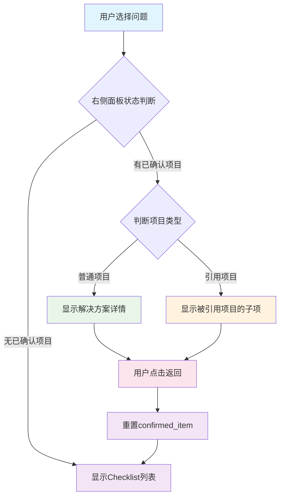

# 运维排查助手 技术设计方案

## 文档变更记录

### 2026-02-10 - UI优化和功能增强
**变更类型**: 功能优化 + Bug修复

**主要变更内容**:
1. **后端API增强**:
   - `serializers.py`: 添加 `checklistCount` 字段统计
   - 递归统计所有子检查项数量（包括深层嵌套）
   - 为 `/api/issues/summary` 接口返回检查单数量

2. **前端架构优化**:
   - 技术栈: React 19 + TypeScript + Vite + Tailwind CSS v4
   - 组件化重构：IssueSelector、IssueDetail、CheckList
   - 状态管理：自定义Hook (useAppState)

3. **前端功能增强**:
   - 首页卡片紧凑化设计，添加检查单数量显示
   - 问题详情页结构重组，新增"相关知识库"模块
   - 智能格式化函数 `formatNumberedList()`，自动识别编号列表

4. **数据格式优化**:
   - YAML数据统一使用 `|` (Literal Style) 保留换行符
   - 简化序列化逻辑，移除复杂的正则表达式处理

5. **Bug修复**:
   - 修复编号列表换行符显示问题
   - 解决JSON序列化后换行符转义在前端丢失的问题

**影响范围**:
- `api/serializers.py` - 添加checklistCount统计逻辑
- `issue-check排查系统/src/app/components/` - 组件重构和优化
- `issue-check排查系统/src/app/services/api.ts` - API接口类型定义
- `data/*.yml` - YAML数据格式统一优化

---

### 2026-01-22 - 功能增强
**变更类型**: 解决方案增强

**主要变更内容**:
1. **ChecklistItem数据模型增强**:
   - 新增 `wiki_links` 字段，支持关联Wiki文档链接列表
   - 新增 `gif_links` 字段，支持关联GIF演示视频链接列表
   - 新增 `script_links` 字段，支持关联脚本文件链接列表
   - 所有字段均为可选，支持多个链接

2. **TreeChecklistItem数据模型增强**:
   - 同步添加 `wiki_links`、`gif_links`、`script_links` 三个字段
   - 使用 `field(default_factory=list)` 确保默认值为空列表
   - 字段顺序调整，符合dataclass规范

3. **数据加载逻辑增强**:
   - `data_loader.py` 支持解析三个新字段
   - 从YAML文件中读取链接列表并传递到数据模型

4. **树形构建逻辑增强**:
   - `tree_builder.py` 构建树形结构时正确传递链接字段
   - 普通项和引用项都支持链接字段

5. **界面渲染增强**:
   - `web_controller.py` 解决方案面板中显示三类链接
   - 📚 相关文档：显示Wiki文档链接
   - 🎬 演示视频：显示GIF演示链接
   - 📜 相关脚本：显示脚本文件链接
   - 自动URL解码，将URL编码的中文路径转换为可读的中文

**影响范围**:
- `src/models/checklist.py`: ChecklistItem和TreeChecklistItem添加三个链接字段
- `src/utils/data_loader.py`: 支持解析链接字段
- `src/utils/tree_builder.py`: 传递链接字段到树形结构
- `src/controllers/web_controller.py`: 界面显示链接并自动解码URL

**用户体验变化**:
- 解决方案页面新增三个链接区域
- 用户可以直接点击查看Wiki文档、演示视频和脚本文件
- URL自动解码显示中文，提升可读性

**YAML数据格式示例**:
```yaml
status: "流任务启动时提示错误信息-资源不足"
describe: "点击日志/告警引擎启动/重启，提示流任务资源不足"
priority: 6
version: "BaaS-v4.14+"
todo: "运维账号登录flink监控页面，修改引擎slots数目"
wiki_links:
  - "https://wiki.das-security.cn/pages/viewpage.action?pageId=32212133"
gif_links:
  - "http://10.50.1.141/release/飞遁数据中台/操作指引/流任务相关/演示.gif"
script_links:
  - "http://10.50.1.141/scripts/check_resource.sh"
```

---

### 2026-01-21 - 功能增强
**变更类型**: 数据管理优化和用户体验提升

**主要变更内容**:
1. **Issue数据模型增强**:
   - 新增 `display` 字段，支持控制问题是否在下拉列表中显示
   - 默认值为 `false`，只有显式设置为 `true` 的问题才会显示
   - 支持问题的分类管理和可见性控制

2. **DataLoader功能大幅增强**:
   - 支持递归读取 data 目录及所有子目录的 YAML 文件
   - 实现数据质量检查报告功能，在初始化时自动检查所有文件
   - 问题列表按优先级降序排列（高优先级在前）
   - 增强的字段完整性检查：status、describe、priority、version、display、checklist

3. **数据质量检查功能**:
   - 检查文件信息完整性（缺失字段、空值、格式错误等）
   - 检查无效的refer引用（区分文件不存在和文件存在但加载失败）
   - 打印详细的数据质量报告，便于维护和调试

4. **Streamlit警告修复**:
   - 修复 ScriptRunContext 警告
   - 将页面配置从类初始化移到 main 函数开头

**影响范围**:
- `src/models/checklist.py`: 添加 display 字段
- `src/utils/data_loader.py`: 大幅增强，新增287行代码
- `src/main_app.py`: 修复页面配置调用时机

**用户体验变化**:
- 问题列表更简洁，只显示设置为可见的问题
- 问题按优先级排序，高优先级问题优先显示
- 支持按子目录分类组织 YAML 文件
- 初始化时提供详细的数据质量反馈

---

## 1. 项目概述

基于Streamlit构建的运维知识库智能排查助手，通过三栏布局设计和智能交互逻辑，为运维人员提供高效的故障排查体验。

## 1. 交互设计理念

### 1.1 核心设计原则

#### 🎯 智能状态管理
系统采用智能状态切换机制，根据用户操作自动调整界面内容，实现无缝排查体验：

1. **Checklist → 解决方案**: 确认检查项后，右侧自动从检查列表切换为解决方案详情
2. **引用项目处理**: 自动识别引用类型（refer），智能显示对应内容
   - 普通引用项目 → 显示被引用项目的子检查项列表
   - 有解决方案项目 → 直接显示解决方案
3. **持续排查**: 支持返回继续排查，不强制中断流程

#### 📍 精准信息展示
采用三栏布局设计，每个面板职责清晰，信息展示精准：

- **左侧面板 (占比1.2)**: 问题选择 + 导航路径
- **中间详情 (占比1.4)**: 始终显示当前检查项的完整信息
- **右侧操作 (占比1.4)**: 根据状态动态切换内容

#### 💡 用户体验优化
- **统一展示规范**: 问题现象和检查项使用相同的展示格式
- **实时视觉反馈**: 排除/确认操作立即反映在界面上
- **无缝操作流程**: 选择 → 查看 → 确认 → 解决，一气呵成

### 1.2 界面交互逻辑

#### 🔄 状态流转机制
```
选择问题 → 显示Checklist → 确认项目 → 内容切换
    ↓           ↓           ↓           ↓
  左侧面板    右侧面板    中间更新    右侧更新
问题选择    检查列表    详情显示    解决方案显示
```

#### 📊 智能切换策略
- **已确认项目检查**：中间显示已确认检查项，右侧显示解决方案
- **未确认项目检查**：中间显示当前排查进展，右侧显示Checklist确认单
- **引用项目检查**：智能判断引用类型，显示相应子检查项或解决方案

## 2. 数据模型设计

### 2.1 核心数据结构

#### 2.1.1 Issue 数据模型
```python
@dataclass
class Issue:
    """问题现象数据模型（支持顶层priority和version）"""
    file_name: str        # yml文件名
    status: str           # 问题现象标题
    describe: str         # 问题描述
    priority: int         # 问题整体优先级(1-10)
    version: str          # 问题影响版本
    checklist: List['ChecklistItem']  # 直接原因checklist列表
    display: bool = False  # 是否在问题列表中显示，默认为False

    def get_checklist_by_priority(self) -> List['ChecklistItem']:
        """按优先级降序返回checklist"""
        return sorted(self.checklist, key=lambda x: x.priority, reverse=True)

    def __post_init__(self):
        """数据验证"""
        if self.priority < 1 or self.priority > 10:
            raise ValueError(f"优先级必须在1-10之间，当前值: {self.priority}")
        if not self.status.strip():
            raise ValueError("status不能为空")
        if self.describe is None:
            raise ValueError("describe不能为None")
```

**字段说明**：
- `display`: 控制问题是否出现在下拉列表中，默认为 `False`。只有设置为 `true` 的问题才会显示在问题选择列表中。这个字段允许我们：
  - 隐藏仅供引用的子问题
  - 控制用户可见的问题范围
  - 支持问题的分类管理

#### 2.1.2 ChecklistItem 数据模型
```python
@dataclass
class ChecklistItem:
    """检查项目数据模型"""
    status: str  # 直接原因现象描述
    describe: str  # 详细说明和确认方法
    priority: int  # 优先级(1-10)
    version: str  # 影响版本范围
    todo: str  # 解决方案描述
    wiki_links: Optional[List[str]] = None  # Wiki文档链接列表
    gif_links: Optional[List[str]] = None  # GIF演示图链接列表
    script_links: Optional[List[str]] = None  # 脚本文件链接列表
    checklist: Optional[List['ChecklistItem']] = None  # 子checklist
    refer: Optional[str] = None  # 相关问题引用
```

**字段说明**：
- `wiki_links`: Wiki文档链接列表，可选字段。用于关联详细的操作文档或知识库文章
- `gif_links`: GIF演示图链接列表，可选字段。用于关联操作演示视频或GIF动图
- `script_links`: 脚本文件链接列表，可选字段。用于关联自动化脚本或工具下载地址
- 所有链接字段都支持多个URL，按列表形式存储

#### 2.1.3 TreeChecklistItem 数据模型
```python
@dataclass
class TreeChecklistItem:
    """树形检查项数据模型（支持refer引用和树形结构）"""
    status: str  # 显示标题
    describe: str  # 描述
    priority: int  # 优先级
    version: str  # 版本
    todo: str  # 解决方案
    source_file: str  # 来源yml文件
    original_path: List[str]  # 原始路径（用于导航）
    wiki_links: List[str] = field(default_factory=list)  # Wiki文档链接列表
    gif_links: List[str] = field(default_factory=list)  # GIF演示图链接列表
    script_links: List[str] = field(default_factory=list)  # 脚本文件链接列表
    children: List['TreeChecklistItem'] = field(default_factory=list)  # 子项
    is_refer: bool = False  # 是否为refer引用的项
    parent_ref: Optional[str] = None  # 父级引用来源
    confirmed: bool = False  # 是否已确认
```

**字段说明**：
- `wiki_links`: Wiki文档链接列表，默认为空列表
- `gif_links`: GIF演示图链接列表，默认为空列表
- `script_links`: 脚本文件链接列表，默认为空列表
- 与ChecklistItem不同，TreeChecklistItem使用`field(default_factory=list)`确保默认值为空列表而非None

#### 2.1.4 应用状态模型
```python
@dataclass
class AppState:
    """应用状态管理（支持智能交互和状态切换）"""
    current_issue: Optional[str] = None                 # 选择的问题名称
    current_issue_name: Optional[str] = None            # 问题名称字段
    current_tree: Optional[TreeChecklistItem] = None    # 当前树形结构
    current_checklist: Optional[TreeChecklistItem] = None  # 当前检查项
    excluded_items: List[str] = field(default_factory=list)    # 已排除项目路径
    navigation_path: List[str] = field(default_factory=list)    # 当前导航路径
    solution_text: Optional[str] = None                     # 当前显示的解决方案
    confirmed_item: Optional[TreeChecklistItem] = None      # 当前已确认的项目

    def get_current_path_display(self) -> str:
        """获取当前路径的显示文本"""
        return " → ".join(self.navigation_path) if self.navigation_path else "未开始排查"

    def is_at_root(self) -> bool:
        """是否在根节点"""
        return len(self.navigation_path) <= 1

    def get_current_checklist_items(self) -> List[TreeChecklistItem]:
        """获取当前层级的checklist项，按优先级排序"""
        if not self.current_checklist:
            if self.current_tree:
                return self.current_tree.get_children_by_priority()
            return []

        return self.current_checklist.get_children_by_priority()

    def has_solution(self) -> bool:
        """当前是否有解决方案"""
        return self.solution_text is not None

    def has_confirmed_item(self) -> bool:
        """是否有已确认的项目"""
        return self.confirmed_item is not None
```

### 2.2 YAML数据解析器

#### 2.2.1 DataLoader 类设计
```python
import yaml
import os
from pathlib import Path
from typing import Dict, List

class DataLoader:
    """YAML数据加载和解析器（支持递归读取和数据质量检查）"""

    def __init__(self, data_dir: str = "data"):
        self.data_dir = Path(data_dir)
        self.issues: Dict[str, Issue] = {}
        self.issue_list: List[str] = []
        self.loaded_files: set = set()  # 记录成功加载的文件
        self.all_yml_files: set = set()  # 记录所有yml文件
        self.file_issues: Dict[str, List[str]] = {}  # 记录每个文件的问题

    def load_all_issues(self) -> Dict[str, Issue]:
        """加载所有yml文件中的问题数据（包括所有子目录）"""
        self.issues.clear()
        self.issue_list.clear()
        self.loaded_files.clear()
        self.all_yml_files.clear()
        self.file_issues.clear()

        # 获取所有yml文件（包括所有子目录）
        yml_files = list(self.data_dir.rglob("*.yml")) + list(self.data_dir.rglob("*.yaml"))

        # 记录所有yml文件
        self.all_yml_files = set(yml_files)

        # 先检查所有文件的完整性
        self._check_all_files_integrity(yml_files)

        for yml_file in yml_files:
            issue = self._parse_yml_file(yml_file)
            if issue:
                self.issues[issue.status] = issue
                self.issue_list.append(issue.status)
                self.loaded_files.add(yml_file)

        # 打印数据质量检查报告
        self._print_data_quality_report()

        return self.issues

    def get_issue_names(self) -> List[str]:
        """获取所有问题名称列表（仅返回display=True的问题，按优先级降序排列）"""
        visible_issues = [issue for issue in self.issues.values() if issue.display]
        sorted_issues = sorted(visible_issues, key=lambda x: x.priority, reverse=True)
        return [issue.status for issue in sorted_issues]

    def _check_all_files_integrity(self, yml_files: List[Path]):
        """检查所有文件的完整性"""
        for yml_file in yml_files:
            rel_path = str(yml_file.relative_to(self.data_dir))
            issues = []

            try:
                with open(yml_file, 'r', encoding='utf-8') as f:
                    data = yaml.safe_load(f)

                # 检查文件是否为空
                if not data:
                    issues.append("文件为空")
                    self.file_issues[rel_path] = issues
                    continue

                # 检查必需字段
                if 'status' not in data:
                    issues.append("缺少status字段（必需）")
                elif not data['status'] or not str(data['status']).strip():
                    issues.append("status字段为空")

                # 检查可选但建议的字段
                if 'describe' not in data:
                    issues.append("缺少describe字段（建议添加）")
                elif data['describe'] is None or not str(data['describe']).strip():
                    issues.append("describe字段为空（建议添加描述）")

                if 'priority' not in data:
                    issues.append("缺少priority字段（默认使用5）")
                elif not isinstance(data['priority'], int) or data['priority'] < 1 or data['priority'] > 10:
                    issues.append(f"priority字段值无效: {data['priority']}（应为1-10的整数）")

                if 'version' not in data:
                    issues.append("缺少version字段（默认使用'-'）")
                elif not str(data['version']).strip():
                    issues.append("version字段为空字符串（建议设置版本范围）")

                if 'display' not in data:
                    issues.append("缺少display字段（默认为false，不会显示在问题列表中）")

                if 'checklist' not in data:
                    issues.append("缺少checklist字段（没有检查项）")
                elif not data['checklist'] or not isinstance(data['checklist'], list):
                    issues.append("checklist字段为空或格式错误")

                # 记录问题
                if issues:
                    self.file_issues[rel_path] = issues

            except yaml.YAMLError as e:
                self.file_issues[rel_path] = [f"YAML解析错误: {str(e)}"]
            except Exception as e:
                self.file_issues[rel_path] = [f"读取文件错误: {str(e)}"]

    def _print_data_quality_report(self):
        """打印数据质量检查报告"""
        print("\n" + "="*60)
        print("📊 数据质量检查报告")
        print("="*60)

        # 1. 显示信息不完整的文件
        if self.file_issues:
            print(f"\n⚠️  以下 {len(self.file_issues)} 个文件信息不完整:")
            for file_path, issues in sorted(self.file_issues.items()):
                print(f"\n   📄 {file_path}:")
                for issue in issues:
                    print(f"      - {issue}")
            print(f"\n   💡 建议: 请补充缺失的字段信息")
        else:
            print("\n✅ 所有文件信息完整")

        # 2. 检查无效的refer引用，并分类
        invalid_refs_not_exist = []  # 引用的文件不存在
        invalid_refs_not_loaded = []  # 文件存在但未加载

        for issue_name, issue in self.issues.items():
            self._collect_invalid_references_detailed(
                issue_name,
                issue.checklist,
                invalid_refs_not_exist,
                invalid_refs_not_loaded
            )

        # 打印文件不存在的引用
        if invalid_refs_not_exist:
            print(f"\n❌ 以下 {len(invalid_refs_not_exist)} 个refer引用的文件不存在:")
            for ref_info in invalid_refs_not_exist:
                print(f"   - 问题 '{ref_info['source']}' 引用了 '{ref_info['target']}'，但文件不存在")
            print("   💡 建议: 请创建对应的yml文件")

        # 打印文件存在但未加载的引用
        if invalid_refs_not_loaded:
            print(f"\n⚠️  以下 {len(invalid_refs_not_loaded)} 个refer引用指向的文件存在但未成功加载:")
            for ref_info in invalid_refs_not_loaded:
                print(f"   - 问题 '{ref_info['source']}' 引用了 '{ref_info['target']}'")
                print(f"     文件: {ref_info['file_path']}")
                print(f"     原因: {ref_info['reason']}")
            print("   💡 建议: 请检查这些yml文件的格式和内容完整性")

        if not invalid_refs_not_exist and not invalid_refs_not_loaded:
            print("\n✅ 所有refer引用都有效")

        print("="*60 + "\n")
```

**主要功能增强**：
1. **递归读取子目录**：使用 `rglob()` 代替 `glob()`，支持从 data 目录及其所有子目录加载 YAML 文件
2. **display字段过滤**：只有 `display=true` 的问题才会在下拉列表中显示
3. **优先级排序**：问题列表按优先级降序排列（高优先级在前）
4. **数据质量检查**：
   - 检查文件完整性（status、describe、priority、version、display、checklist等字段）
   - 检查无效的refer引用（文件不存在或文件存在但加载失败）
   - 打印详细的数据质量报告


class TreeBuilder:
    """树形结构构建器 - 处理refer引用和树形结构拼接"""

    def __init__(self, data_loader: DataLoader):
        self.data_loader = data_loader
        self.built_trees = {}

    def build_complete_tree(self, root_issue_name: str) -> Optional[TreeChecklistItem]:
        """构建完整的树形结构"""
        if root_issue_name in self.built_trees:
            return self.built_trees[root_issue_name]

        root_issue = self.data_loader.get_issue_by_name(root_issue_name)
        if not root_issue:
            return None

        # 构建根节点
        root_tree = TreeChecklistItem(
            status=root_issue.status,
            describe=root_issue.describe,
            priority=root_issue.priority,
            version=root_issue.version,
            todo="",  # 根问题没有todo
            source_file=root_issue.file_name,
            original_path=[root_issue.status],
            is_refer=False
        )

        # 递归构建子树
        for item in root_issue.checklist:
            child_tree = self._build_child_tree(item, root_issue.file_name, [root_issue.status])
            if child_tree:
                root_tree.children.append(child_tree)

        # 缓存构建结果
        self.built_trees[root_issue_name] = root_tree
        return root_tree

    def _build_child_tree(self, item: ChecklistItem, parent_file: str, path: List[str]) -> Optional[TreeChecklistItem]:
        """构建子树"""
        if hasattr(item, 'refer') and item.refer:
            # 处理refer引用
            return self._build_refer_tree(item.refer, parent_file, path)
        else:
            # 处理普通项
            tree_item = TreeChecklistItem(
                status=item.status,
                describe=item.describe,
                priority=item.priority,
                version=item.version,
                todo=item.todo or "",
                source_file=parent_file,
                original_path=path + [item.status],
                is_refer=False
            )

            # 递归处理子项
            if hasattr(item, 'checklist') and item.checklist:
                for child_item in item.checklist:
                    child_tree = self._build_child_tree(child_item, parent_file, path + [item.status])
                    if child_tree:
                        tree_item.children.append(child_tree)

            return tree_item

    def _build_refer_tree(self, refer_name: str, parent_file: str, path: List[str]) -> Optional[TreeChecklistItem]:
        """构建引用树"""
        refer_issue = self.data_loader.get_issue_by_name(refer_name)
        if not refer_issue:
            return None

        # 创建引用节点
        refer_tree = TreeChecklistItem(
            status=refer_issue.status,
            describe=refer_issue.describe,
            priority=refer_issue.priority,
            version=refer_issue.version,
            todo="",  # 引用的问题本身没有todo
            source_file=refer_issue.file_name,
            original_path=path + [f"[引用]{refer_name}"],
            is_refer=True,
            parent_ref=parent_file
        )

        # 递归构建引用问题的子项
        for item in refer_issue.checklist:
            child_tree = self._build_child_tree(item, refer_issue.file_name, path + [f"[引用]{refer_name}"])
            if child_tree:
                refer_tree.children.append(child_tree)

        return refer_tree

    def _parse_yml_file(self, file_path: Path) -> Optional[Issue]:
        """解析单个yml文件"""
        try:
            with open(file_path, 'r', encoding='utf-8') as f:
                data = yaml.safe_load(f)

            if not data or 'status' not in data:
                return None

            checklist_items = []
            for item_data in data.get('checklist', []):
                checklist_item = self._parse_checklist_item(item_data)
                if checklist_item:
                    checklist_items.append(checklist_item)

            return Issue(
                file_name=file_path.stem,
                status=data['status'],
                describe=data.get('describe', ''),
                checklist=checklist_items
            )

        except Exception as e:
            print(f"解析文件 {file_path} 失败: {e}")
            return None

    def _parse_checklist_item(self, item_data: dict) -> Optional[ChecklistItem]:
        """解析checklist项目"""
        if 'status' not in item_data:
            return None

        # 处理refer类型
        if 'refer' in item_data:
            return ChecklistItem(
                status=f"引用: {item_data['refer']}",
                describe=f"关联到问题: {item_data['refer']}",
                priority=1,
                version="-",
                todo=f"跳转到问题: {item_data['refer']}",
                refer=item_data['refer']
            )

        # 处理普通checklist项
        checklist_subitems = []
        for subitem_data in item_data.get('checklist', []):
            subitem = self._parse_checklist_item(subitem_data)
            if subitem:
                checklist_subitems.append(subitem)

        return ChecklistItem(
            status=item_data['status'],
            describe=item_data.get('describe', ''),
            priority=item_data.get('priority', 5),
            version=item_data.get('version', '-'),
            todo=item_data.get('todo', ''),
            checklist=checklist_subitems if checklist_subitems else None,
            refer=item_data.get('refer')
        )

    def get_issue_names(self) -> List[str]:
        """获取所有问题名称列表"""
        return self.issue_list.copy()
```

### 1.3 数据验证器

#### 1.3.1 DataValidator 类设计
```python
class DataValidator:
    """数据验证器"""

    @staticmethod
    def validate_issue(issue: Issue) -> List[str]:
        """验证Issue数据完整性"""
        errors = []

        if not issue.status:
            errors.append("问题现象不能为空")

        if not issue.checklist:
            errors.append("checklist不能为空")

        for i, item in enumerate(issue.checklist):
            item_errors = DataValidator.validate_checklist_item(item, f"checklist[{i}]")
            errors.extend(item_errors)

        return errors

    @staticmethod
    def validate_checklist_item(item: ChecklistItem, path: str = "") -> List[str]:
        """验证ChecklistItem数据完整性"""
        errors = []
        current_path = f"{path}.{item.status}" if path else item.status

        if not hasattr(item, 'status') or not item.status:
            # 处理纯refer项
            if hasattr(item, 'refer') and item.refer:
                return errors  # 纯refer项没有status是正常的
            else:
                errors.append(f"{current_path}: status不能为空")

        if hasattr(item, 'priority') and (item.priority < 1 or item.priority > 10):
            errors.append(f"{current_path}: priority应该在1-10之间")

        if hasattr(item, 'checklist') and item.checklist:
            for i, subitem in enumerate(item.checklist):
                subitem_errors = DataValidator.validate_checklist_item(
                    subitem, f"{current_path}.checklist[{i}]"
                )
                errors.extend(subitem_errors)

        return errors
```

## 2. 系统架构设计

### 2.1 整体架构

#### 2.1.1 Web应用架构设计
```
┌─────────────────────────────────────────────────────────────┐
│                    Web表示层 (Web Presentation Layer)         │
│  ┌─────────────────┐  ┌─────────────────┐  ┌─────────────────┐ │
│  │  Streamlit      │  │  侧边栏         │  │  主内容区       │ │
│  │  Web界面        │  │  问题选择       │  │  详情面板       │ │
│  │  响应式设计     │  │  统计信息       │  │  检查清单       │ │
│  └─────────────────┘  └─────────────────┘  └─────────────────┘ │
├─────────────────────────────────────────────────────────────┤
│                    业务逻辑层 (Business Layer)               │
│  ┌─────────────────┐  ┌─────────────────┐  ┌─────────────────┐ │
│  │ IssueManager    │  │ ChecklistManager│  │ PathNavigator   │ │
│  │ SolutionEngine  │  │ StateManager    │  │  InteractionLogic│ │
│  └─────────────────┘  └─────────────────┘  └─────────────────┘ │
├─────────────────────────────────────────────────────────────┤
│                    数据访问层 (Data Access Layer)            │
│  ┌─────────────────┐  ┌─────────────────┐  ┌─────────────────┐ │
│  │ DataLoader      │  │ DataValidator   │  │  FileWatcher    │ │
│  │ YamlParser      │  │ CacheManager    │  │  ConfigLoader   │ │
│  └─────────────────┘  └─────────────────┘  └─────────────────┘ │
└─────────────────────────────────────────────────────────────┘
```

#### 2.1.2 Streamlit Web架构优势
- **简化开发**: 无需HTML/CSS/JavaScript知识，纯Python开发
- **实时预览**: 代码修改后浏览器自动刷新
- **响应式设计**: 自动适配桌面、平板、手机等设备
- **丰富组件**: 内置图表、表格、侧边栏等Web组件
- **状态管理**: 内置session_state管理用户会话状态

### 2.2 核心组件设计

#### 2.2.1 Web应用控制器 (WebController)
```python
import streamlit as st
from typing import Dict, List, Optional

class WebController:
    """Streamlit Web应用控制器"""

    def __init__(self):
        self.data_loader = DataLoader()
        self.app_state = AppState()
        self.tree_builder = TreeBuilder(self.data_loader)
        self.app_state.tree_builder = self.tree_builder

    def initialize_session_state(self):
        """初始化Streamlit会话状态"""
        if 'current_issue' not in st.session_state:
            st.session_state.current_issue = None
        if 'navigation_path' not in st.session_state:
            st.session_state.navigation_path = []
        if 'excluded_items' not in st.session_state:
            st.session_state.excluded_items = []
        if 'solution_text' not in st.session_state:
            st.session_state.solution_text = None

    def render_sidebar(self) -> Optional[str]:
        """渲染侧边栏并返回选择的问题"""
        with st.sidebar:
            st.title("🔧 运维排查助手")

            # 问题选择
            issue_names = list(self.data_loader.load_all_issues().keys())
            if issue_names:
                selected_issue = st.selectbox(
                    "📋 选择问题现象",
                    options=issue_names,
                    key="issue_selector"
                )

                if st.button("🔄 重置", key="reset_button"):
                    self._reset_session_state()
                    st.rerun()

                return selected_issue
            return None

    def handle_issue_selection(self, issue_name: str):
        """处理问题选择"""
        if issue_name != st.session_state.get('current_issue'):
            issue = self.data_loader.get_issue_by_name(issue_name)
            if issue:
                self.app_state.set_current_issue(issue)
                self.app_state.build_current_tree()
                st.session_state.current_issue = issue_name
                st.session_state.navigation_path = [issue_name]
                st.session_state.excluded_items = []
                st.session_state.solution_text = None

    def _reset_session_state(self):
        """重置会话状态"""
        for key in st.session_state.keys():
            del st.session_state[key]
        self.initialize_session_state()
```

#### 2.2.2 问题管理器 (IssueManager)
```python
class IssueManager:
    """问题管理器"""

    def __init__(self, data_loader: DataLoader):
        self.data_loader = data_loader

    def get_issue_by_name(self, name: str) -> Optional[Issue]:
        """根据名称获取问题"""
        return self.data_loader.issues.get(name)

    def search_issues(self, keyword: str) -> List[Issue]:
        """搜索问题"""
        keyword = keyword.lower()
        results = []

        for issue in self.data_loader.issues.values():
            if (keyword in issue.status.lower() or
                keyword in issue.describe.lower()):
                results.append(issue)

        return results

    def get_all_issue_names(self) -> List[str]:
        """获取所有问题名称"""
        return self.data_loader.get_issue_names()
```

#### 2.2.3 树形Checklist管理器 (TreeChecklistManager)
```python
class TreeChecklistManager:
    """树形Checklist管理器"""

    def __init__(self, app_state: AppState):
        self.app_state = app_state

    def get_current_checklist(self) -> List[TreeChecklistItem]:
        """获取当前层级的checklist"""
        return self.app_state.get_current_checklist_items()

    def exclude_checklist_item(self, item: TreeChecklistItem):
        """排除checklist项"""
        item_path = " → ".join(item.original_path)
        if item_path not in self.app_state.excluded_items:
            self.app_state.excluded_items.append(item_path)

    def confirm_checklist_item(self, item: TreeChecklistItem) -> Optional[str]:
        """确认checklist项，返回解决方案"""
        if item.children:
            # 有子项，跳转到子层级
            self.app_state.current_checklist = item
            self.app_state.navigation_path = item.original_path.copy()
            return None
        else:
            # 叶子节点，返回解决方案
            return item.todo

    def navigate_to_parent(self) -> bool:
        """导航到父级"""
        if len(self.app_state.navigation_path) <= 1:
            return False

        # 移除当前节点
        self.app_state.navigation_path.pop()

        # 查找父节点
        parent_path = self.app_state.navigation_path.copy()
        parent_item = self._find_item_by_path(self.app_state.current_tree, parent_path)

        if parent_item:
            self.app_state.current_checklist = parent_item
            return True

        return False

    def _find_item_by_path(self, tree: TreeChecklistItem, path: List[str]) -> Optional[TreeChecklistItem]:
        """根据路径查找树节点"""
        current = tree

        for path_part in path[1:]:  # 跳过根节点
            found = False
            for child in current.children:
                if child.status == path_part or f"[引用]{child.status}" == path_part:
                    current = child
                    found = True
                    break

            if not found:
                return None

        return current
```

### 2.3 导航系统设计

#### 2.3.1 路径导航器 (PathNavigator)
```python
class PathNavigator:
    """路径导航器"""

    def __init__(self, app_state: AppState):
        self.app_state = app_state

    def navigate_to_level(self, level: int) -> bool:
        """导航到指定层级"""
        if level < 0 or level >= len(self.app_state.navigation_path):
            return False

        # 截断路径到指定层级
        self.app_state.navigation_path = self.app_state.navigation_path[:level]

        # 重置当前checklist到对应层级
        if level == 0:
            self.app_state.current_checklist = None
        else:
            # 根据路径找到对应的checklist项
            target_item = self._find_checklist_by_path(self.app_state.navigation_path)
            self.app_state.current_checklist = target_item

        return True

    def _find_checklist_by_path(self, path: List[str]) -> Optional[ChecklistItem]:
        """根据路径查找checklist项"""
        if not path or not self.app_state.current_issue:
            return None

        current_checklist = self.app_state.current_issue.checklist

        for path_item in path[1:]:  # 跳过第一个，那是问题名称
            for item in current_checklist:
                if item.status == path_item:
                    if item.checklist:
                        current_checklist = item.checklist
                        break
            else:
                return None

        # 找到目标项
        for item in current_checklist:
            if item.status == path[-1]:
                return item

        return None

    def get_current_path(self) -> List[str]:
        """获取当前导航路径"""
        if not self.app_state.current_issue:
            return []

        path = [self.app_state.current_issue.status]
        path.extend(self.app_state.navigation_path[1:])  # 跳过重复的问题名称
        return path
```

## 3. 系统架构设计

### 3.1 三栏布局架构

#### 3.1.1 整体架构设计
```
┌─────────────────────────────────────────────────────────────┐
│                    Web表示层 (Web Presentation Layer)         │
│  ┌─────────────────┐  ┌─────────────────┐  ┌─────────────────┐ │
│  │   左侧导航面板   │  │    中间详情面板   │  │    右侧操作面板   │ │
│  │                │  │                │  │                │ │
│  │ • 问题选择     │  │ • 当前检查项    │  │ • Checklist列表  │ │
│  │ • 导航路径     │  │ • 详细信息      │  │ • 解决方案      │ │
│  │ • 返回上级     │  │ • 优先级/版本  │  │ • 动态切换      │ │
│  └─────────────────┘  └─────────────────┘  └─────────────────┘ │
├─────────────────────────────────────────────────────────────┤
│                    业务逻辑层 (Business Layer)               │
│  ┌─────────────────┐  ┌─────────────────┐  ┌─────────────────┐ │
│  │ StateManager    │  │ TreeBuilder     │  │ WebController   │ │
│  │ 状态管理        │  │ 树形构建        │  │ 界面控制        │ │
│  │ • 智能切换     │  │ • 引用处理      │  │ • 交互逻辑      │ │
│  │ • 路径导航     │  │ • 缓存管理      │  │ • 用户响应      │ │
│  └─────────────────┘  └─────────────────┘  └─────────────────┘ │
├─────────────────────────────────────────────────────────────┤
│                    数据访问层 (Data Access Layer)            │
│  ┌─────────────────┐  ┌─────────────────┐  ┌─────────────────┐ │
│  │ DataLoader      │  │ DataValidator   │  │  FileWatcher    │ │
│  │ YAML解析        │  │ 数据验证        │  │  文件监控      │ │
│  │ 动态加载        │  │ 类型检查        │  │  热更新        │ │
│  └─────────────────┘  └─────────────────┘  └─────────────────┘ │
└─────────────────────────────────────────────────────────────┘
```

#### 3.1.2 智能状态管理架构
```
用户操作 → 状态更新 → 界面切换 → 用户反馈
    ↓         ↓         ↓         ↓
  点击确认   更新confirmed_item  判断is_refer  显示内容
  选择问题   更新navigation_path  获取current_node  显示详情
  排除项目   更新excluded_items   设置excluded   视觉反馈
```

### 3.2 核心交互流程设计

#### 3.2.1 智能状态切换流程


#### 3.2.2 导航路径管理
```python
# 导航路径示例
navigation_path = ["日志引擎启动异常", "yarn节点异常", "yarn节点相关机器时间不一致"]

# 界面展示逻辑
if len(navigation_path) <= 1:
    # 显示问题详情
    display_node = current_tree
else:
    # 显示当前排查进展
    display_node = get_current_checklist_item()

# 支持快速跳转
for i, path_item in enumerate(navigation_path):
    if st.button(f"跳转到: {path_item}"):
        target_path = navigation_path[:i+1]
        navigate_to_path(target_path)
```

## 4. 功能模块详细设计

### 4.1 Web界面模块 (WebInterface)

#### 3.1.1 Streamlit主应用类 (MainApp)
```python
import streamlit as st
from typing import Dict, List, Optional

class MainApp:
    """Streamlit主应用类"""

    def __init__(self):
        self.controller = WebController()
        self.setup_page_config()

    def setup_page_config(self):
        """设置页面配置"""
        st.set_page_config(
            page_title="运维知识库智能排查助手",
            page_icon="🔧",
            layout="wide",
            initial_sidebar_state="expanded"
        )

    def run(self):
        """运行主应用"""
        # 初始化会话状态
        self.controller.initialize_session_state()

        # 渲染侧边栏
        selected_issue = self.controller.render_sidebar()

        # 处理问题选择
        if selected_issue:
            self.controller.handle_issue_selection(selected_issue)

        # 渲染主内容区
        self._render_main_content()

    def _render_main_content(self):
        """渲染主内容区"""
        if not st.session_state.get('current_issue'):
            self._show_welcome_screen()
            return

        # 显示标题
        st.title(f"🔍 {st.session_state.current_issue}")

        # 创建两列布局
        col1, col2 = st.columns([1, 3])

        with col1:
            self._render_navigation_panel()

        with col2:
            self._render_detail_panel()
            self._render_checklist_panel()
            self._render_solution_panel()

    def _show_welcome_screen(self):
        """显示欢迎界面"""
        st.markdown("""
        # 🔧 运维知识库智能排查助手

        请从左侧选择要排查的问题现象，开始智能排查流程。

        ## 使用说明
        1. 从左侧选择问题现象
        2. 查看问题详情
        3. 逐项确认checklist
        4. 获取解决方案

        选择问题后，系统将引导您完成排查流程。
        """)

    def _render_navigation_panel(self):
        """渲染导航面板"""
        st.subheader("📍 当前排查路径")

        navigation_path = st.session_state.get('navigation_path', [])
        if navigation_path:
            for i, path_item in enumerate(navigation_path):
                if i == 0:
                    st.markdown(f"📁 **{path_item}**")
                else:
                    indent = "　　" * i
                    if i == len(navigation_path) - 1:
                        st.markdown(f"{indent}◉ **{path_item}**")
                    else:
                        st.markdown(f"{indent}└─ {path_item}")
        else:
            st.info("未开始排查")

    def _render_detail_panel(self):
        """渲染详情面板"""
        st.subheader("📋 当前问题详情")

        # 获取当前问题信息
        issue_name = st.session_state.get('current_issue')
        if issue_name:
            issue = self.controller.data_loader.get_issue_by_name(issue_name)
            if issue:
                col1, col2 = st.columns(2)
                with col1:
                    st.metric("优先级", issue.priority)
                with col2:
                    st.metric("版本", issue.version if issue.version else "-")

                st.markdown(f"**问题描述**: {issue.describe}")

    def _render_checklist_panel(self):
        """渲染检查清单面板"""
        st.subheader("✅ Checklist确认单")

        # 获取当前检查清单
        checklist_items = self.controller.app_state.get_current_checklist_items()

        if not checklist_items:
            st.info("没有检查项")
            return

        for i, item in enumerate(checklist_items):
            with st.expander(f"{item.status} (优先级: {item.priority})"):
                st.write(item.describe)

                col1, col2 = st.columns([1, 1])

                with col1:
                    excluded_key = f"exclude_{i}"
                    if st.checkbox(f"排除 {item.status}", key=excluded_key):
                        self._handle_exclude_item(item)

                with col2:
                    confirm_key = f"confirm_{i}"
                    if st.button(f"确认 {item.status}", key=confirm_key):
                        self._handle_confirm_item(item)

    def _render_solution_panel(self):
        """渲染解决方案面板"""
        solution_text = st.session_state.get('solution_text')
        if solution_text:
            st.subheader("🛠️ 解决方案")
            st.success(solution_text)

    def _handle_exclude_item(self, item):
        """处理排除项目"""
        if item.status not in st.session_state.get('excluded_items', []):
            st.session_state.excluded_items.append(item.status)
            st.success(f"已排除: {item.status}")
            st.rerun()

    def _handle_confirm_item(self, item):
        """处理确认项目"""
        if item.todo:
            # 显示解决方案
            st.session_state.solution_text = item.todo
            st.success(f"确认原因: {item.status}")
            st.rerun()
        elif hasattr(item, 'children') and item.children:
            # 进入下一层级
            self.controller.app_state.current_checklist = item
            new_path = st.session_state.navigation_path.copy()
            new_path.append(item.status)
            st.session_state.navigation_path = new_path
            st.session_state.solution_text = None
            st.rerun()
        else:
            st.info("需要进一步排查子项")
  #### 3.1.2 Web界面渲染器 (WebRenderer)
```python
import streamlit as st
from typing import Dict, List, Optional

class WebRenderer:
    """Web界面渲染器"""

    @staticmethod
    def render_checklist_item(item, index: int):
        """渲染单个检查项"""
        with st.expander(f"{item.status} (优先级: {item.priority})"):
            st.write(item.describe)

            col1, col2 = st.columns([1, 1])

            with col1:
                excluded = st.checkbox(f"排除 {item.status}", key=f"exclude_{index}")
                if excluded:
                    return 'exclude'

            with col2:
                if st.button(f"确认 {item.status}", key=f"confirm_{index}"):
                    return 'confirm'

        return None

    @staticmethod
    def render_solution_steps(todo_text: str, wiki_links=None, gif_links=None, script_links=None):
        """渲染解决方案步骤"""
        st.subheader("🛠️ 解决方案")

        with st.success("解决方案已找到"):
            st.markdown("**操作步骤:**")

            # 简单的步骤解析（假设todo中包含编号步骤）
            lines = todo_text.split('\n')
            for line in lines:
                line = line.strip()
                if line and (line[0].isdigit() or line.startswith('-')):
                    st.markdown(f"- {line}")
                elif line:
                    st.markdown(line)

        st.markdown("---")

        # 📚 Wiki文档链接
        if wiki_links:
            st.markdown("### 📚 相关文档")
            from urllib.parse import unquote
            for wiki_url in wiki_links:
                decoded_url = unquote(wiki_url)
                st.markdown(f'- [{decoded_url}]({wiki_url})', unsafe_allow_html=True)

        # 🎬 GIF演示链接
        if gif_links:
            st.markdown("### 🎬 演示视频")
            from urllib.parse import unquote
            for gif_url in gif_links:
                decoded_url = unquote(gif_url)
                st.markdown(f'- [{decoded_url}]({gif_url})', unsafe_allow_html=True)

        # 📜 脚本文件链接
        if script_links:
            st.markdown("### 📜 相关脚本")
            from urllib.parse import unquote
            for script_url in script_links:
                # 提取文件名并解码
                script_name = script_url.split("/")[-1] if "/" in script_url else script_url
                decoded_name = unquote(script_name)
                st.markdown(f'- [{decoded_name}]({script_url})', unsafe_allow_html=True)

    @staticmethod
    def render_progress_stats(current_issue: str, excluded_items: List[str]):
        """渲染进度统计"""
        col1, col2, col3 = st.columns(3)

        with col1:
            st.metric("当前问题", current_issue)

        with col2:
            st.metric("已排除", len(excluded_items))

        with col3:
            # 这里可以计算剩余项目数
            st.metric("排查状态", "进行中" if excluded_items else "待开始")
```
  ### 3.2 Web部署和配置

#### 3.2.1 应用入口文件 (main.py)
```python
#!/usr/bin/env python3
"""
运维知识库智能排查助手 - Streamlit Web版本
"""

import sys
from pathlib import Path

# 添加项目路径
project_root = Path(__file__).parent
sys.path.insert(0, str(project_root))

import streamlit as st
from src.web_app import MainApp

def main():
    """主函数"""
    app = MainApp()
    app.run()

if __name__ == "__main__":
    main()
```

#### 3.2.2 Streamlit配置文件 (.streamlit/config.toml)
```toml
[theme]
primaryColor = "#FF6B6B"
backgroundColor = "#FFFFFF"
secondaryBackgroundColor = "#F0F2F6"
textColor = "#262730"
font = "sans serif"

[server]
headless = true
port = 8501
address = "localhost"

[browser]
gatherUsageStats = false
```

#### 3.2.3 依赖管理 (requirements.txt)
```txt
# 核心依赖
streamlit>=1.28.0
PyYAML>=6.0

# 数据处理
pandas>=1.5.0  # 可选，用于数据分析功能

# 部署相关
gunicorn>=21.2.0  # 生产环境部署
```

#### 3.2.4 启动脚本
**Windows启动脚本** (scripts/start_web.bat):
```batch
@echo off
echo 启动运维排查助手Web版本...
cd /d "%~dp0.."

# 检查Python环境
python --version >nul 2>&1
if errorlevel 1 (
    echo 错误: 未找到Python环境
    pause
    exit /b 1
)

# 检查依赖
echo 检查依赖...
pip install -r requirements.txt

# 启动Streamlit应用
echo 启动Web应用...
streamlit run src/web_app.py --server.headless false --server.port 8501

pause
```

**Linux/Mac启动脚本** (scripts/start_web.sh):
```bash
#!/bin/bash
echo "启动运维排查助手Web版本..."

# 切换到项目根目录
cd "$(dirname "$0")/.."

# 检查Python环境
if ! command -v python3 &> /dev/null; then
    echo "错误: 未找到Python3环境"
    exit 1
fi

# 检查依赖
echo "检查依赖..."
pip3 install -r requirements.txt

# 启动Streamlit应用
echo "启动Web应用..."
streamlit run src/web_app.py --server.headless false --server.port 8501
```

  ## 5. 交互逻辑优势总结

### 5.1 智能化用户体验

#### 🔄 无缝状态切换
- **自动判断内容类型**: 系统智能识别是显示Checklist列表还是解决方案
- **引用项目处理**: 自动识别refer类型，显示被引用项目的子检查项
- **持续排查支持**: 用户可以随时返回继续排查，不会中断流程

#### 📍 精准信息管理
- **统一展示标准**: 问题现象和检查项使用相同的展示格式
- **实时状态更新**: 所有操作立即反映在界面上
- **视觉层次清晰**: 排除项目删除线、确认项目高亮显示

#### ⚡ 高效操作流程
- **一次性展示**: 所有检查项直接显示，无需逐级展开
- **智能排序**: 按优先级自动排序，优先处理关键问题
- **快速导航**: 点击路径任意节点快速跳转

### 5.2 技术架构优势

#### 🏗️ 模块化设计
- **分层架构**: 表示层、业务层、数据层职责清晰
- **强类型安全**: 使用dataclass确保代码质量和类型安全
- **可扩展性**: 新增问题或功能模块化扩展

#### 💾 数据管理优化
- **YAML驱动**: 结构化配置，易于维护和扩展
- **知识复用**: 通过refer引用避免重复维护
- **动态加载**: 支持热更新，无需重启应用

#### 🎨 交互设计创新
- **三栏布局**: 左侧导航 + 中间详情 + 右侧操作，信息层次清晰
- **智能切换**: 根据用户操作自动调整界面内容
- **直观操作**: emoji图标按钮配合悬浮提示

### 5.3 实际应用价值

#### 🚀 提升排查效率
- **快速定位**: 通过优先级排序和智能导航快速找到问题
- **知识复用**: 通过引用避免重复维护相同排查流程
- **经验积累**: 结构化保存运维经验和解决方案

#### 📈 降低维护成本
- **配置驱动**: 非技术人员也能维护排查知识库
- **统一标准**: 标准化的格式和展示方式
- **版本管理**: 支持YAML文件的版本控制和团队协作

### 5.4 扩展性和灵活性

#### 🔧 技术扩展
- **多引擎支持**: 可扩展支持其他排查引擎（如ElasticSearch、Prometheus等）
- **API集成**: 可集成外部API获取实时监控数据
- **AI增强**: 可集成大模型提供智能建议

#### 📱 部署灵活
- **本地部署**: 支持内网独立部署
- **云端部署**: 支持Docker容器化部署
- **多环境**: 开发、测试、生产环境配置灵活

这个创新的交互设计方案，通过智能状态管理和精准信息展示，为运维人员提供了前所未有的排查体验，显著提升了运维效率和问题解决能力。
